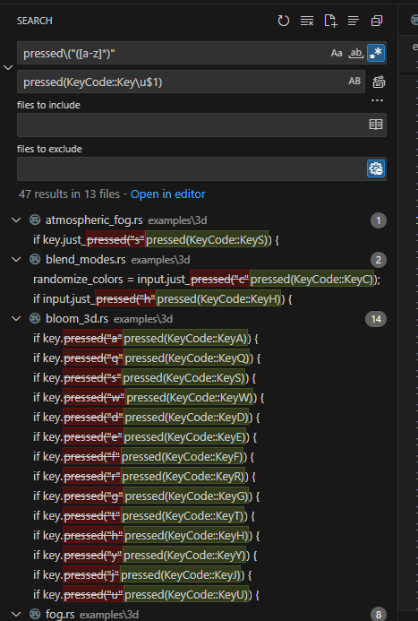

+++
title = "Contribution Story"
description = "Follow me in a deep contribution story."
date = 2023-10-14T09:19:42+00:00
updated = 2023-10-25T09:19:42+00:00
draft = false
template = "drafts/page.html"
dream = "dream-tangled.gif"

[extra]
lead = "I've got a dream!"
+++

 
 

# My Dream

Once upon a time, I had a vision of 2 very different players, playing very different games...

YET! They were able to share items, laughing and enjoying interaction in their very different experience.

Can you picture that?

If not, you can imagine a grandmother 👵 winning candies 🍬 in her favorite match3 game,
sending sweat powerups to her grandchild playing his favorite action game 🔫.

Very different games, but very real impact! 😘 "Thanks Grandma!"

# Prologue

To showcase my Grand Dream™️, I've got to build a demo!

I could make a simple local demo, sharing items offline, stored on the disk.

I could.

No.

I go big.

## Multiplayer

So first things first, I install <a href=https://www.rust-lang.org>Rust</a>.

Then I make <a href="https://github.com/Vrixyz/backpack">server</a>.

## Demo

So first things first, I make a <a href="https://github.com/Vrixyz/backpack/tree/main/crates/example_game_lazy">small game</a>.

Then I make a <a href="https://github.com/Vrixyz/backpack/tree/main/crates/client">client library</a> to connect to my server.

Then I plug things together.

# Surprise!

So my plan was:
- Input a mail
- Input a password
- Create an account or connect to it
- Enjoy the API and relax.

Ah well, I have to tell you about my keyboard, I have an AZERTY one. To input `@`, I have to use <kbd>Alt-gr</kbd>.

I use bevy_egui for testing purposes (and there is no input on bevy_ui heh!)

But when I try to input `@` with my keyboard, nothing appears!

That's a problem, because every email address have an `@`...

## What's the root problem?

[To keep it short](https://github.com/mvlabat/bevy_egui/pull/149), the problem is that winit handles <kbd>Alt-gr</kbd> by sending `ctrl` + `alt`,
bevy_egui was ignoring all keys if ctrl was held. It makes sense, since ctrl is used as a "command" key on windows.

🎉 So [I fixed that](https://github.com/mvlabat/bevy_egui/pull/149), First PR in this story! 🎉

## Again.

I want to support web, but I realized my fix wasn't working on web...

[I tried to fix it again](https://github.com/mvlabat/bevy_egui/pull/181) on bevy_egui, but the handling of meta key in OSX
was proving difficult to provide an exact solution.

## Adapt, overcome!

OK, I spent quite some time on that issue now, I'm taking a break, keep a note somewhere and call it **The Altgr Problem**.

# The **copy-paste problem**

By the way, my authentication process involves a password sent to the user so he can copy it in the password field.

On wasm, bevy_egui doesn't support copying from external source, the copy is only stored from and to local (process) memory.
That's not useful to me!

## What's the root problem?

[I tracked down the problem](https://github.com/mvlabat/bevy_egui/pull/178) to the [ar board crate](https://github.com/1Password/arboard), which is [not interested in supporting web](https://github.com/1Password/arboard/issues/99) because their API is fully synchronous, fair enough, let's fix it on [bevy_egui's side!](https://github.com/mvlabat/bevy_egui/pull/178)[^3]

[^3]: There's probably room for a cross-platform copy paste crate, don't you think?

### Down the rabbit hole

Using [web-sys crate](https://rustwasm.github.io/wasm-bindgen/api/web_sys/) and a few [documentation](https://developer.mozilla.org/en-US/docs/Web/API/ClipboardEvent), I had most of the implementation ready.

Most.

On web MacOS, bevy_egui currently handles copy-paste with ctrl-[XCV] ; it's wrong, because it should be Meta-[XCV], But at least it's working.

Now, reacting to clipboard web events fixes the inconsistency, GREAT right? I wish!

I discovered yet another problem [within winit](https://github.com/mvlabat/bevy_egui/pull/178#issuecomment-1571038329):
Meta key not correcty forwarded from winit.

# Winit

Thankfully, winit's folks have already detected all the shortcomings I found throughout this blog post, and a [big keyboard input refactoring](https://github.com/rust-windowing/winit/pull/2662) was almost ready.

At this point, I have 3 issues related to winit, most likely fixed with winit 0.29, let's try to update!

I asked around on bevy discord if anyone was working on it before rolling up my sleeves!

> "Not a fun update"

_François Mockers_

I've been warned.

## The tip of the iceberg.

The first task to upgrade our winit' API usage was to rename most of the Key enums.
As bevy provides a abstraction over winit for modularity's sake, that meant a few regex search and replace.

With good tooling the task wasn't too tedious.

## Thanks for the help

Thanks to bevy maintainers and other contributors, I could ask my way through:
- `Copy` trait issues
- foreign types to implement bevy_reflect on top of ([SmolStr](https://github.com/bevyengine/bevy/pull/8771) 🎉)
- getting a confidence boost when I was in doubt ❤️
- [minor fmt fixes](https://github.com/bevyengine/bevy/pull/10264)

## I have to tell you about...

_I could start a farm with all those rabbit holes I followed..._

## instant crate

winit [replaced instant by web_time](https://github.com/rust-windowing/winit/pull/2836),
I checked on the dependencies also using instant, updated what I could, and made a note on what I could not.
`cargo tree -i` [again](http://thierryberger.com/drafts/bevy-ios-ads/#naive-implementation) my best ally.

## AccessKit

Of course AccessKit doesn't support winit 0.29, it's not released yet (when I started).

So I [started a PR](https://github.com/AccessKit/accesskit/pull/256), just enough to unblock my compilation,
but sharing my work so it's helpful to others.

When winit released, the interest seemed high, and [maintainers stepped in 🎉](https://github.com/AccessKit/accesskit/pull/256#issuecomment-1779944498).

## What if we could choose not to upgrade all ecosystem?

What if ecosystem crates could support every older versions of more foundation-y crates?

We could upgrade to the latest ecosystem, but still have a few outdated ones!

Right?

Well dependencies are hard, we could leverage [rustc conditional compilation](https://doc.rust-lang.org/reference/conditional-compilation.html) through [cargo features](https://doc.rust-lang.org/cargo/reference/features.html) to support all edge cases...

I see you shouting "UNMAINTAINABLE!".

Well.

winit folks [did go the "hard way"](https://github.com/rust-mobile/ndk/pull/434): they have features for `raw-window-handle` version 0.4, 0.5, 0.6 (a.k.a `rwh_04`, `rwh_05`, `rwh_06`).

it's cool, because I don't have to wait on wgpu to update to latest `rwh_06`!

So I chose to rely on `rwh_05`.

That said, I ran a quick `cargo tree -i` to see if my dependency tree war coherent...
and `rwh_06` was still pulled in.

winit and ndk had [their default](https://github.com/rust-mobile/ndk/pull/434#issuecomment-1752089087) on `rwh_06`. I had disabled default features for those, but `android-activity` did not, so [we worked on a fix](https://github.com/rust-mobile/android-activity/pull/142) 🎉.

## "AAAAAA"

Everything is compiling at this point! What were we trying to achieve ?

I forgot, something related to keyboard input... Let's try the keyboard example.

It's working!

let's try to break it:
- Press shift
- press 'A'
- release shift
- release 'a'

Congratulations, I broke bevy_input. bevy_input thinks 'A' is still pressed: "Of course, you released 'a', a totally different letter!", the program told me.

We can't have a reliable cache on characters
if we can't have reliable events on those.

And that might be an issue on resume/suspend, but that's another story.

 

My PR is already quite big, and fixing that might involve a few experimentation and controversial changes,
So I chose to break it out, [check it out!](https://github.com/Vrixyz/bevy/pull/3).

I went for my guts, and implemented a "dynamic cache", relying on the underlying keycode,
but keeping in memory the current logical key.

## Better API (maybe, maybe not)

Within bevy_input, we expose 2 api to interrogate which input is on which state:
- `Input<Key>`
- `Input<KeyCode>`

I took the opportunity to change it to a more unified
- `Input<KeyLogic>` where `KeyLogic` is either a keycode (or scan code) or a logicalKey (key displayed on user's keyboard).

To this date, I'm still not 100% sure about that, if you're up to the challenge, [please review 🙏](https://github.com/Vrixyz/bevy/pull/3).

## A sizeable problem

That's a pun on resizable windows, yeah.

bevy (<= 0.12) had difficulties redrawing smoothly when resizing, [I made the problem worse!](https://github.com/bevyengine/bevy/pull/8745#discussion_r1387034412)

TODO: Maybe This chapter will continue...

## Window out, window in

Winit now supports launching a window again through run_ondemand, [bevy still has to accomodate these changes](https://github.com/bevyengine/bevy/pull/8745#discussion_r1387056104).

TODO: Maybe This chapter will continue...

## Licensing

Hey, open source is hard work! Licensing exists and protects everybody from users to maintainers.

I encountered 2 licenses withing rust-windowing wihch bevy doesn't honour: keycodes and cursor icons.

TODO: Maybe This chapter will continue...

## Still ongoing

I took a few controversial decisions throughout my upgrade, and that's a risk that my PR will be delayed/reworked.

I'll update this blog post until this winit PR gets merged.

[Check my PR out!](https://github.com/bevyengine/bevy/pull/8745)

I wrote about all that not to show how software can be broken, but how it can be fixed! Let's fix it together!

[❤️ Also I'm grateful for my sponsors, you enable me to help you! ❤️](https://github.com/sponsors/Vrixyz)