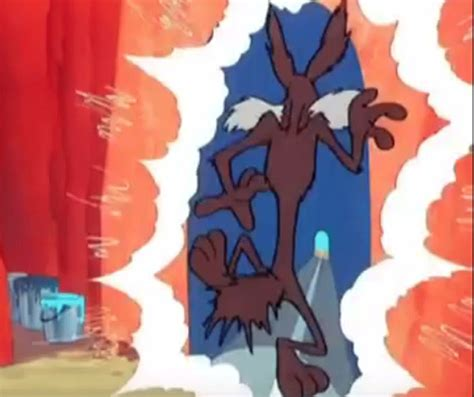

+++
title = "Contribution Story"
description = "Follow me in a deep contribution story."
date = 2023-10-14T09:19:42+00:00
updated = 2023-10-27T09:19:42+00:00
draft = false
template = "drafts/page.html"
dream = "dream-tangled.gif"

[extra]
lead = "I've got a dream!"
+++

 
 

# My Dream

Once upon a time, I had a vision of 2 very different players, playing very different games...

YET! They were able to share items, laughing and enjoying interaction in their very different experience.

Can you picture that?

If not, you can imagine a grandmother winning candies in her favorite match3 game,
sending sweat powerups to her grandchild playing his favorite action game.

Very different games, but very real impact! "Thanks Grandma!"

# Prologue

To showcase my Grand Dream™️, I've got to build a demo!

I could make a simple local demo, sharing items offline, stored on the disk.

I could.

No.

I go big.

## Multiplayer

So first things first, I install <a href=https://www.rust-lang.org>Rust</a>.

Then I make a server.

## Demo

So first things first, I make a small game.

Then I make a client library to connect to my server.

Then I plug things together.

# Surprise!

So my plan was:
- Input a mail/password
- Create an account or connect to it
- Enjoy the API and relax.

Ah well, I have to tell you about my keyboard, I have an AZERTY one. To input `@`, I have to use <kbd>Alt-gr</kbd>.

I use bevy_egui for testing purposes (and there is no input on bevy_ui heh!)

But when I try to input `@` with my keyboard, nothing appears!

That's a problem.

## What's the root problem?

[To keep it short](https://github.com/mvlabat/bevy_egui/pull/149), the problem is that winit handles altgr by sending `ctrl` + `alt`,
bevy_egui was ignoring all keys if ctrl was held. It makes sense, since ctrl is used as a "command" key on windows.

🎉 So I fixed that, First PR in this story! 🎉

## Again.

I want to support web, but I realized my fix wasn't working on web...
